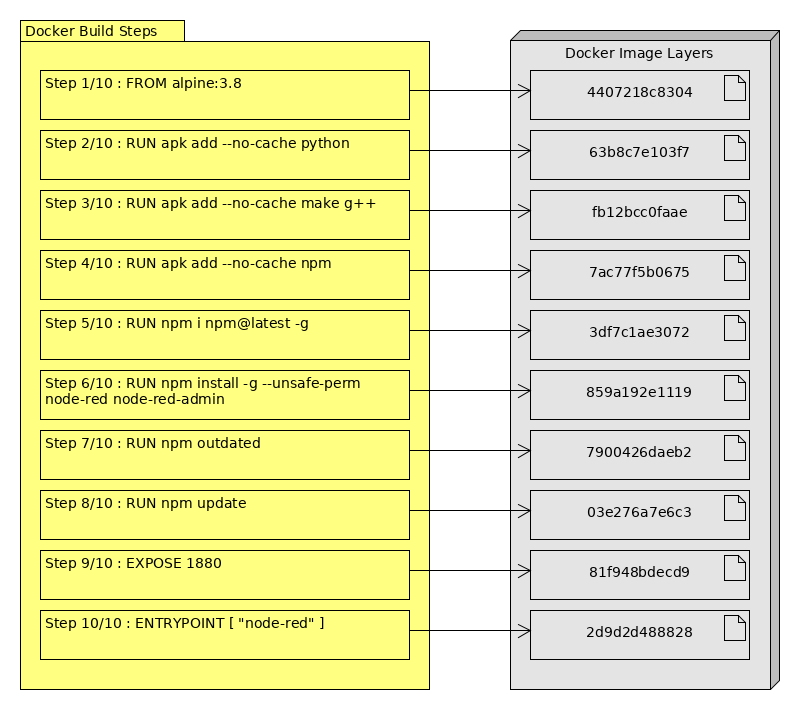
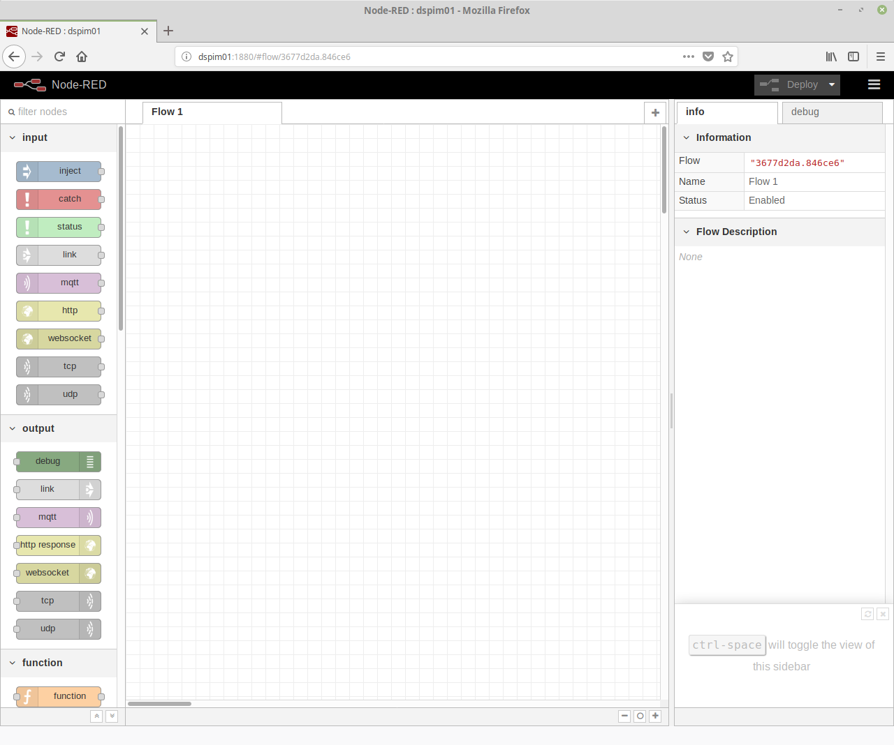

# Build containers (for Raspberry Pi)
Although there are many containers and projects available on [Docker Hub](https://hub.docker.com) not all of these images provides support for ARM architectures. So it is necessary to build our own containers.

**Before we start the following requirements are need:**

- Raspberry Pi 3
- [Hypriot OS](https://blog.hypriot.com/)
- or [Raspbian](https://www.raspberrypi.org/downloads/raspbian/) with [Docker](https://docs.docker.com/install/linux/docker-ce/ubuntu/#install-using-the-repository) installed

For more information on how to install and use Hypriot OS (also for an Docker Swarm) read my documentation on my [Github projects](https://github.com/andz-dev/projects/tree/master/raspberry_pi/docker/swarm).

**Note:** You can use this documentation to create images on any platform you want. This example explains the image creation on a Raspberry Pi.

## Node-RED container
In this example we want to build a [Node-RED](https://nodered.org/) image for the ARM platform.
With Node-RED we have a powerful flow editor to create rules and transport data between different technologies and interfaces based on [Node.js](https://nodejs.org).
If we have a look on the [Docker Hub project page](https://hub.docker.com/r/nodered/node-red-docker/) there is already an official container for x64 platforms but not for ARM.

## Preparations
Building our own docker images a _Dockerfile_ on the target platform is needed. Docker use this file for its _build_ command to get all the necessary information from it and create a new image.

1. Login to the Pi via SSH
    ```$ sh {USER}@{IP|HOSTNAME}```
2. Create a new directory structure inside the users home and create an empty _Dockerfile_

    ```sh
    $ cd ~
    $ mkdir docker docker/nodered
    $ cd docker/nodered
    $ touch Dockerfile
    ```

3. Open the Dockerfile with an editor of your choice (I use _nano_)
    ```$ nano Dockerfile```

## Dockerfile
A Dockerfile normally contains the following tags:

- ```FROM``` the base image from which the new image should be created
- ```LABEL``` a key value pair to enter author and version information
- ```ENV``` sets some environments for the build process
- ```RUN``` executes commands
- ```EXPOSE``` defines which ports should be published when the container starts
- ```ENTRYPONT``` specifies a command that will always be executed when the container starts
- ```CMD``` specifies arguments that will be fed to the ```ENTRYPOINT```
- ```#``` is used for commentaries
- ```\``` split lines for better readability
- You can also use command chains => [Is there a difference between ; and && and |? [duplicate]](https://unix.stackexchange.com/questions/159489/is-there-a-difference-between-and-and):

  - ```;```: commands separated by a ```;``` are executed sequentially. The shell waits for each command to terminate in turn.
  - ```&&```: command after && is executed if, and only if, command before ```&&``` returns an exit status of zero. You can think of it as _AND_ operator.
  - ```|```: a pipe. In expression ```command1 | command2``` The standard output of ```command1``` is connected via a pipe to the standard input of ```command2```.

The ```FROM``` tag specifies the base image we want to use. For this we have a look on the Docker Hub and can choose from various Linux base systems like [Ubuntu](https://hub.docker.com/_/ubuntu/), [Debian](https://hub.docker.com/_/debian/) and so on.
For a small image on ARM boards I prefer the [Alpine Linux](https://hub.docker.com/_/alpine/) container image because it is very small with such 5 MB disk usage. A documentation how to use the Alpine container can be [found here](http://gliderlabs.viewdocs.io/docker-alpine/).

For more information about the difference between ```ENTRYPOINT``` and ```RUN``` read [this stackoverflow thread](https://stackoverflow.com/questions/21553353/what-is-the-difference-between-cmd-and-entrypoint-in-a-dockerfile).

Now we can edit our Dockerfile:

```Dockerfile
# Use the Alpine base container image
FROM alpine:3.8

LABEL Maintainer "Andreas Elser"
LABEL Version "0.1"

# Install some necessary tools because some nodes needs to be rebuild
RUN apk add --no-cache python
RUN apk add --no-cache make g++
RUN apk add --no-cache npm

# Install Node-RED described in the official documentation
RUN npm i npm@latest -g
RUN npm install -g --unsafe-perm node-red node-red-admin rpi-gpio

# Expose the default Node-RED port
EXPOSE 1880

# Define the entrypoint and start Node-RED
ENTRYPOINT [ "node-red" ]
```

## Building the image
After that we build the image with `docker build -t nodered-arm:0.1 .` where `-t` defines a new tag (name) for our image and `.` stands for the directory where the dockerfile is. The image is created locally and available on our device only.

```sh
$ docker build -t nodered-arm:0.1 .
Sending build context to Docker daemon  2.048kB
Step 1/10 : FROM alpine:3.8
 ---> 4407218c8304
Step 2/10 : RUN apk add --no-cache python
 ---> Using cache
 ---> 63b8c7e103f7
Step 3/10 : RUN apk add --no-cache make g++
 ---> Using cache
 ---> fb12bcc0faae
Step 4/10 : RUN apk add --no-cache npm
 ---> Using cache
 ---> 7ac77f5b0675
Step 5/10 : RUN npm i npm@latest -g
 ---> Using cache
 ---> 3df7c1ae3072
Step 6/10 : RUN npm install -g --unsafe-perm node-red node-red-admin
 ---> Using cache
 ---> 859a192e1119
Step 7/10 : RUN npm outdated
 ---> Using cache
 ---> 7900426daeb2
Step 8/10 : RUN npm update
 ---> Using cache
 ---> 03e276a7e6c3
Step 9/10 : EXPOSE 1880
 ---> Running in 4a7aff21f25d
Removing intermediate container 4a7aff21f25d
 ---> 81f948bdecd9
Step 10/10 : ENTRYPOINT [ "node-red" ]
 ---> Running in 3eb4db824006
Removing intermediate container 3eb4db824006
 ---> 2d9d2d488828
Successfully built 2d9d2d488828
Successfully tagged nodered-arm:0.1
```

### Analyze build process
During the build process we see docker create some _intermediate_ containers. If we get some build errors docker can continue the last failed step instead of re-building the complete image. This is very helpful because we work with _Image Layers_ for a better build process handling.



If we run ```docker images``` non-tagged images are shown.

```sh
$ docker images
REPOSITORY            TAG                 IMAGE ID            CREATED              SIZE
nodered-arm           0.1                 2d9d2d488828        10 seconds ago       284MB
<none>                <none>              1346fa1d7728        About a minute ago   260MB
<none>                <none>              6cb029743e52        6 minutes ago        284MB
<none>                <none>              77dc45f1a97e        17 minutes ago       164MB
<none>                <none>              af68dd52635f        23 minutes ago       164MB
<none>                <none>              ffe31d891d3b        39 minutes ago       122MB
<none>                <none>              86f2b368d514        2 hours ago          122MB
<none>                <none>              120db780f498        3 hours ago          98.5MB
alpine                3.8                 4407218c8304        2 weeks ago          4.01MB
```

And if we run ```docker ps -a``` also dummy containers shown.

```sh
$ docker ps -a
CONTAINER ID        IMAGE                        COMMAND                  CREATED              STATUS                          PORTS                    NAMES
2f77efc5ac10        03e276a7e6c3                 "/bin/sh -c 'npm cac…"   55 seconds ago       Exited (1) 51 seconds ago                                elastic_northcutt
a939e38116d0        1346fa1d7728                 "/bin/sh -c 'npm cac…"   About a minute ago   Exited (1) About a minute ago                            awesome_brattain
37c2d1d7f61a        4407218c8304                 "/bin/sh -c 'apg add…"   27 minutes ago       Exited (127) 27 minutes ago                              wonderful_aryabhata
```

For freeing up disk space you can delete the dummy containers and layer images. But this means on the next time you rebuild the image it is necessary to create all steps from the beginning. On greater Docker builds its time consuming on the Pi.

## Run container
After a successful build we can try to start our container. For this we use the ```docker run``` command.

```sh
$ docker run -it --rm --name test -p 1880:1880 nodered-arm:0.1
```

Because the container starts interactively ```-it``` we see the console output of Node-RED.
If all was set up correctly Node-RED should be available on your local network via _http://{IP|HOSTNAME}:1880_.



To stop the container press ```CTRL + C``` inside your terminal. The container is stopping and removing because of the ```--rm``` parameter.

## Manage container data
If you want to know more about how to work with container data follow [my tutorial for the Raspberry Pi](https://github.com/andz-dev/projects/tree/master/raspberry_pi/docker/volumes).